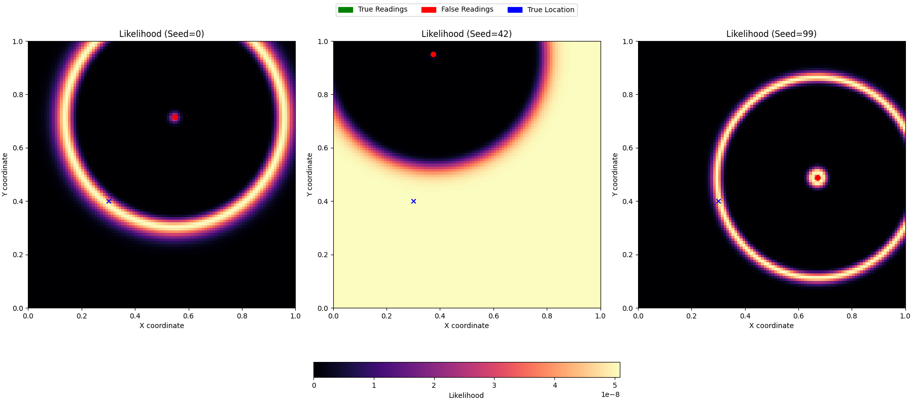
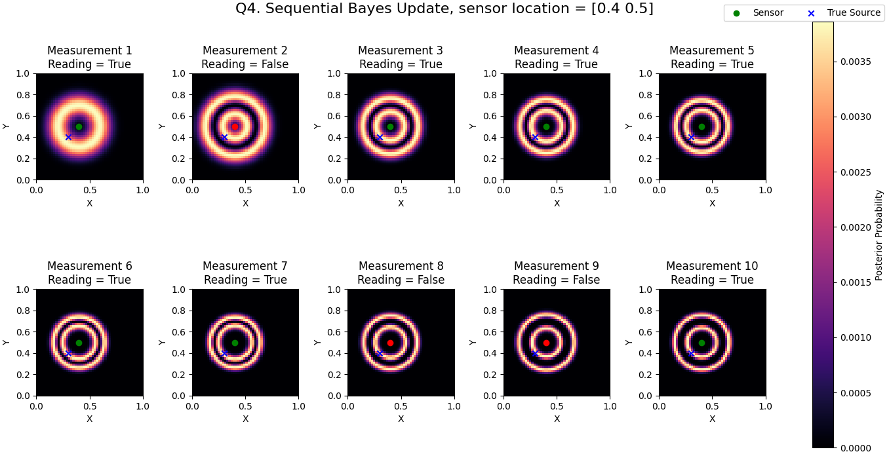
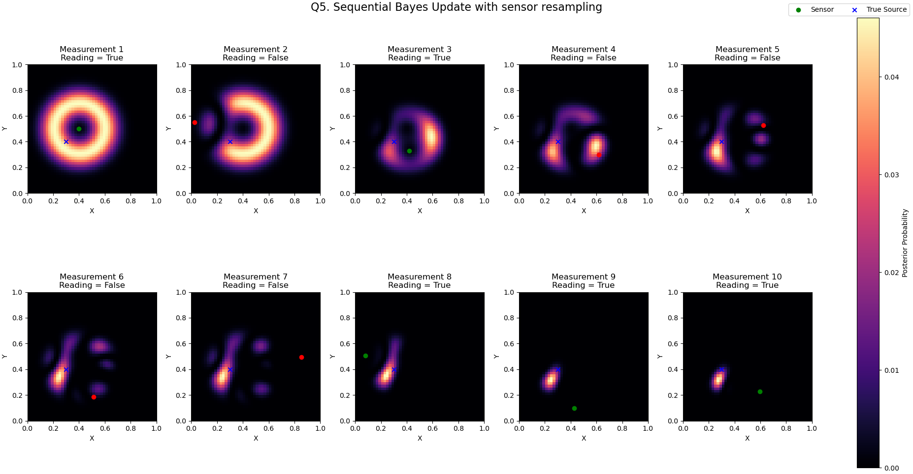

# ME455 HW1 - Zhengyang Kris Weng Submission
04/04/2025

## Q1. Assume the source location is s = [0.3, 0.4], uniformly sample 100 locations in the space, and simulate one measurement for each location. Plot the measurements in the space, if the measurement is positive, plot it as a green dot, otherwise plot it as a red dot. Visualize the “ring-shaped” background seen in Figure 1 as well.   

## Q2. Visualize the likelihood function L(s), which is in the same domain as the sensor, across the whole search space X with the measurements from Problem 1. Visualize the measurements on top of the likelihood function plot (with the same color scheme from Problem 1). Note that you will need a mesh grid with at least 50 grid cells per dimension to suciently visualize the likelihood function. It is recommended to have 100 grid cells per dimension.

## Q3. Repeat the process for Problem 2, but uniformly sample one location in the space and assume that the sensor is stuck at that location for all 100 measurements. Note that the results may vary based on your samples. So randomize your samples for multiple times and feel free to include up to 3 plots if the results are different.    
    

## Q4. Assume the same source location and assume you do not know the source location but instead would like to localize the source from sequential online observations. Uniformly sample one location in the space and assume that the sensor is stuck at that location. Simulate 10 measurements sequentially at that location. For each new measurement from the sensor, use Bayes’ rule to update the belief of the source location, with the initial belief being a uniform distribution. 

For each measurement, visualize the source location (even though your algorithm does not know it), the location where you take the measurement, the measurement (green for positive, red for negative), and the current belief. Organize the plots from the 10 measurements into a 2-by-5 grid.

I placed sensor location at s=[0.4, 0.5] so there's a higher chance proccing the true reading on the sensor.    

## Q5. Repeat the process for Problem 4, but instead of fixing the location for measurement, you can sample at a new location to take each new measurement. You can choose the sampling strategy for the sensor location, though uniform sampling is sufficient.

I used uniform sampling for resampling sensor location. The initial location is the same as Q4, s=[0.4, 0.5].    
