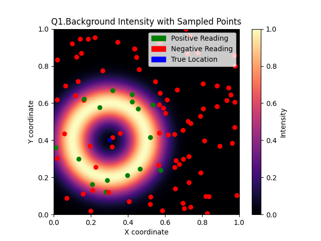
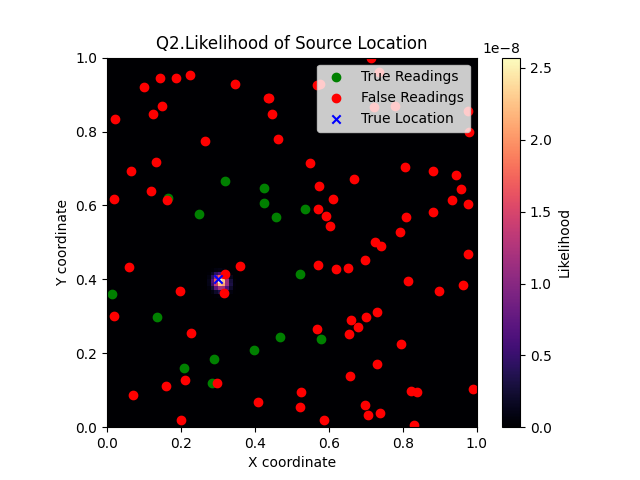

# ME455 HW1 - Zhengyang Kris Weng Submission
04/04/2025

## Q1. Assume the source location is s = [0.3, 0.4], uniformly sample 100 locations in the space, and simulate one measurement for each location. Plot the measurements in the space, if the measurement is positive, plot it as a green dot, otherwise plot it as a red dot. Visualize the “ring-shaped” background seen in Figure 1 as well.   

## Q2. Visualize the likelihood function L(s), which is in the same domain as the sensor, across the whole search space X with the measurements from Problem 1. Visualize the measurements on top of the likelihood function plot (with the same color scheme from Problem 1). Note that you will need a mesh grid with at least 50 grid cells per dimension to suciently visualize the likelihood function. It is recommended to have 100 grid cells per dimension.
