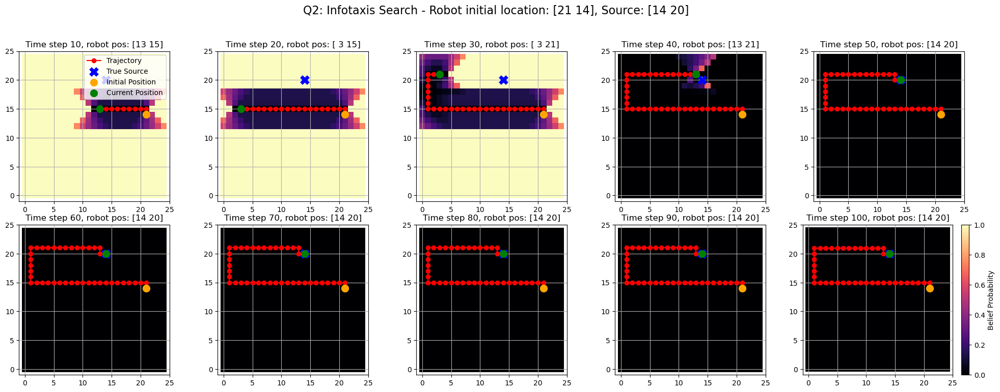

# ME455 HW2 - Zhengyang Kris Weng Submission
04/13/2025

# Randomly sample a source location and an initial location of the robot. Develop an exploration strategy, at each time step, select an action (up, down, left, right, stay still) to quickly explore the search space. After executing each action, simulate a measurement, and use Bayesian update to update the belief of the source location. Run your exploration strategy for 100 time steps. 
Turn in: A 2-by-5 grid plot showing the belief and the robot trajectory at time step: 10, 20, . . . , 100.

# Randomly sample a source location and an initial location of the robot. Implement the Infotaxis algorithm to choose the optimal action at each time step to maximize the expected entropy reduction until convergence. Generate 3 trials. 
Turn in: Three 2-by-5 grid plots showing the belief and the robot trajectory at different time steps of each search trial.

 

