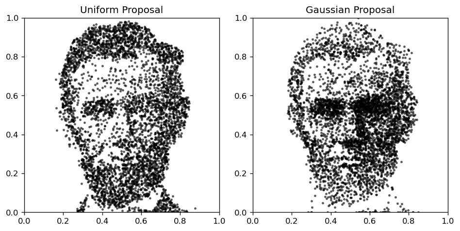
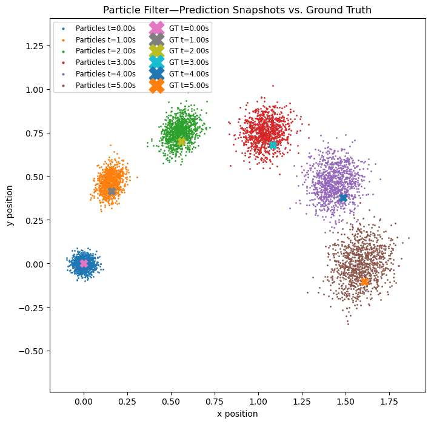
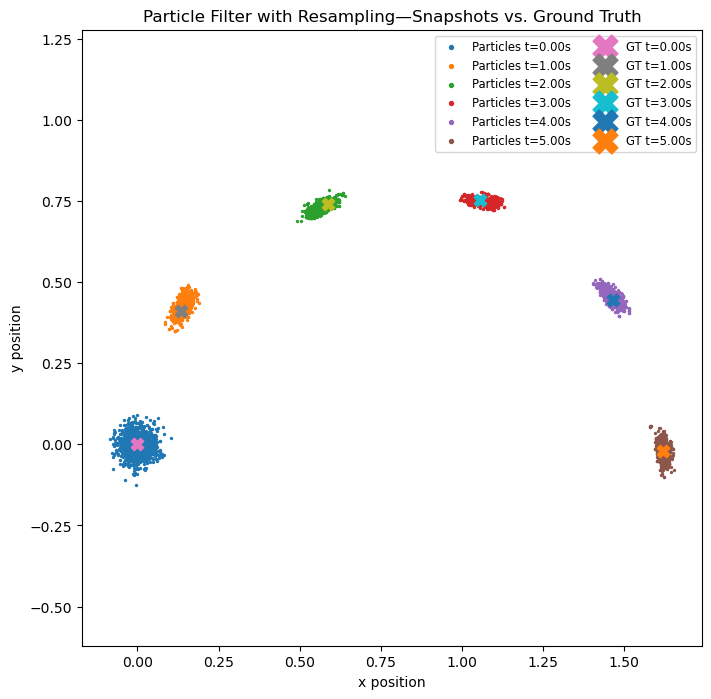

# ME455 HW3 - Zhengyang Kris Weng Submission
04/27/2025

### 1. Given the image here, convert it into a continuous probability density function over a space of 1 meter by 1 meter (you can find the example code for how to do it here). Implement rejection sampling to sample 5000 points from this image-based probability distribution. Select two different proposal distributions of your choice for your implementation.

### 2.1 First, implement only the prediction step of the particle filter (without incorpo- rating the measurement for belief update) and simulate the system for 100 time steps using 1000 particles. Turn in the plots of the particle-based belief estimation and the ground truth state at time steps: 0, 20, 40, 60, 80, 100.

### 2.2 Second, implement the resampling step in the particle filter. Turn in the plots of the particle-based belief estimation and the ground truth state at time steps: 0, 20, 40, 60, 80, 100.

