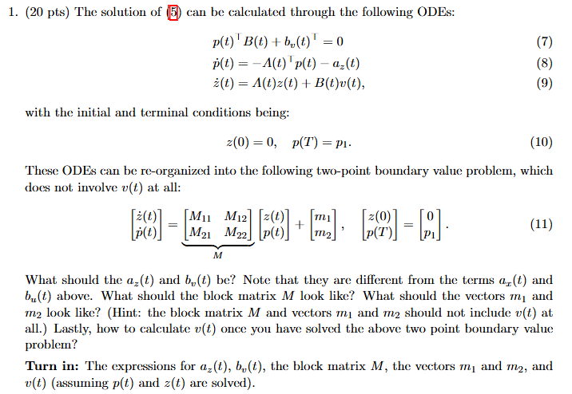
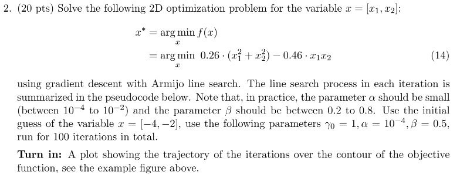
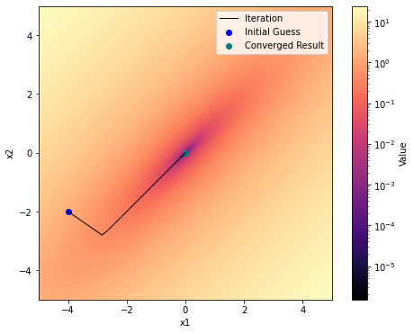
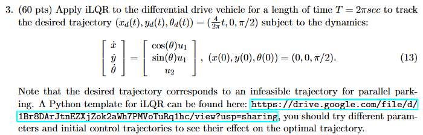
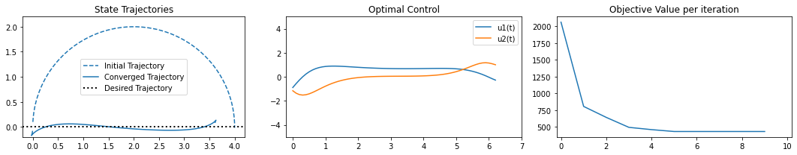
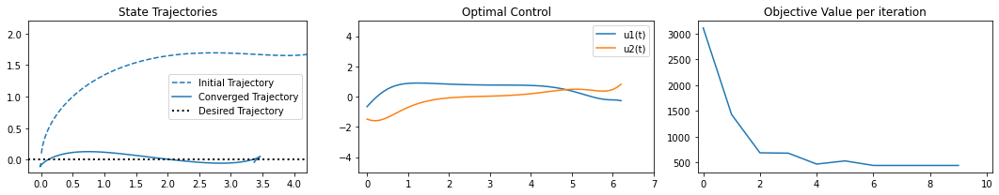
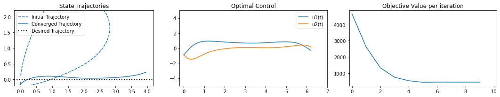

# ME455 HW4 - Zhengyang Kris Weng Submission
05/16/2025

# 1. 

$a_z(t) = l_x(t)^T + Q_z z(t) = (D_1l(x(t)^{[k]}, u(t)^{[k]}))^T + Q_z z(t)$

$b_u(t) = (D_2l(x(t)^{[k]}, u(t)^{[k]}))^T + R_v v(t)$ 

$$
M = \begin{bmatrix} A(t) & -B(t)R_v(t)^{-1}B(t)^T \\ -Q_z(t) & -A(t)^T \end{bmatrix}
$$

From the matrix above:

$$
m_1(t) = -B(t)R_v(t)^{-1}l_u(t)^T = -B(t)R_v(t)^{-1}(D_2l(x(t)^{[k]}, u(t)^{[k]}))^T
$$

$$
m_2(t) = -l_x(t)^T = -(D_1l(x(t)^{[k]}, u(t)^{[k]}))^T
$$

$$
v(t) = -R_v(t)^{-1} (B(t)^T p(t) + l_u(t)^T)
$$

# 2.

See code implementation in `hw4.ipynb`

# 3.

See code implementation in `hw4.ipynb`

First set:  

Second set:

Third set:
