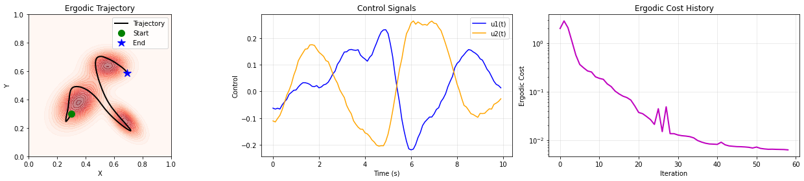
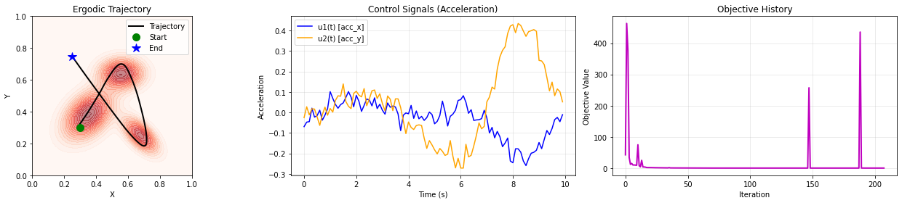
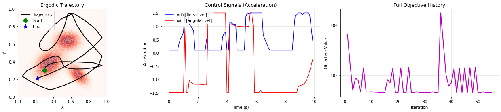

# ME455 HW45- Zhengyang Kris Weng Submission
05/30/2025

# 1. Generate an ergodic trajectory with a time horizon of 10 seconds with dt= 0.1s.

Wow this was a really tough one!! I struggled *a lot* calculating coefficients and formulating ergodic metric, balancing regularization and number of basis functions - until I looked at the provided notebook lol.

# 2. Generate an ergodic trajectory with the same specifications from the last problem, but with the system dynamics being a second-order system

Boundary reflection was quite tricky - too small a step also fails line search but too large will make it OOB and evantually converges to trajectories that don't make sense. 

# 3. Generate an ergodic trajectory With the same specifications from the last problem,but with the system being a differential-drive vehicle and initial condition being [0.3,0.3,pi/2 ]. Note that you only need to evaluate the ergodic metric over the x,y position of the robot.

I could arguably make the diff-drive dynamics better but I'm about to pass out so here it is.

